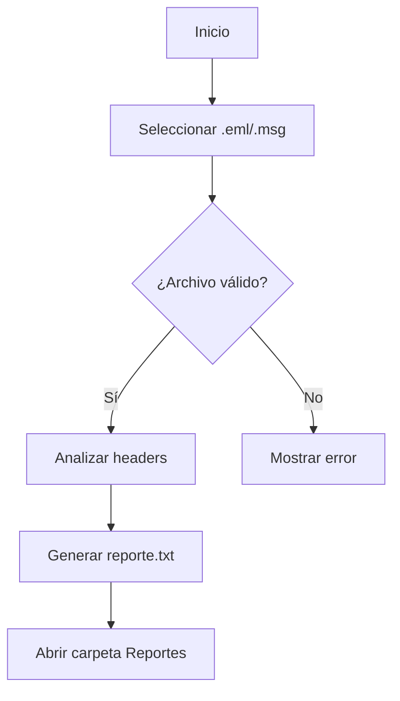

# 📧 Analizador de Headers de Correo Electrónico

## 📌 Descripción

Este script analiza archivos de correo electrónico (`.eml` o `.msg`) para detectar:

- Spoofing/fraude
- IPs y dominios sospechosos
- Reenvíos (forwards)
- Autenticación SPF/DKIM/DMARC
- Metadatos ocultos

## 🛠️ Requisitos

```bash
pip install (librerias)
```

## 🚀 Cómo usar

1. **Ejecutar el script**:

   ```bash
   python Spoof_a.py
   ```

2. **Seleccionar archivo**:

   - Se abrirá una ventana para elegir el `.eml` o `.msg`

3. **Resultados**:
   - Reporte generado en: `./Reportes/Reporte_NOMBREARCHIVO.txt`
   - La carpeta se abre automáticamente al finalizar

## 🔄 Flujo de trabajo



## 📂 Estructura de archivos

```
📦tu_directorio/
├── 📜analizador.py
├── 📜.gitignore
└── 📂Reportes/
   ├── 📜Reporte_correo1.txt
   └── 📜Reporte_correo2.txt
```

## ⚙️ Personalización

Edita estas funciones según necesidades:

```python
def analyze_email(file_path):
    """Aquí va tu lógica de análisis personalizada"""
    # return {
    #   "EVIDENCE": {...},
    #   "ANALYSIS": {...}
    # }
```

## 📝 Formato del reporte

Ejemplo de salida:

```txt
=== ÚLTIMO ANÁLISIS: 2024-03-30 18:22:10 ===
• Archivo: phishing.msg
• Ruta completa: C:\correos\phishing.msg

=== EVIDENCE ===
Valid Headers: YES
Email Content: YES
Is Forwarded?: NO

=== ANALYSIS RESULTS ===
Spoofed Email Account/Identity: YES
Source IP: 100.102.122.211 (domainexamp.com)
[...]
```

## 💡 Consejos

1. Para análisis batch:

   ```python
   # Ejecutar en bucle para múltiples archivos
   for file in os.listdir("correos/"):
       if file.endswith((".eml", ".msg")):
           analyze_email(f"correos/{file}")
   ```

2. Para integrar con Outlook:

   ```vba
   ' Macro de Outlook para exportar y analizar
   Sub AnalizarCorreo()
       ExportAsEML(Selection.Item(1))
       Shell "python C:\ruta\analizador.py"
   End Sub
   ```

## 🐛 Solución de problemas

Si ves `ImportError`:

- Verifica que tengas Python 3.6+
- Ejecuta:

  ```bash
  pip install -r requirements.txt
  ```
